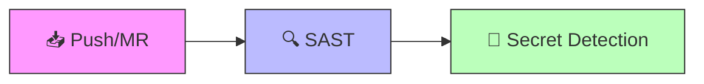
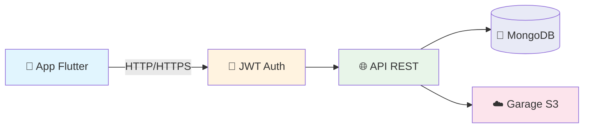

<div align="center">

# 📱 RDV Mobile - Registro de Despesas de Viagens

**Aplicativo mobile para gerenciamento de despesas de viagens em transportadoras rodoviárias.**

Permite registrar viagens, despesas detalhadas por tipo (abastecimento, alimentação, pedágio, manutenção e outros) e gerenciar perfil de usuário.


</div>

---

## 📋 Sumário

- [Sobre o Projeto](#-sobre-o-projeto)
- [Tecnologias](#-tecnologias)
- [Estrutura do Projeto](#-estrutura-do-projeto)
- [Instalação](#-instalação)
- [Executando o App](#-executando-o-app)
- [Testes](#-testes)
- [CI/CD](#-cicd)
- [Arquitetura](#-arquitetura)
- [Plataformas Suportadas](#-plataformas-suportadas)
- [Projetos Relacionados](#-projetos-relacionados)
- [Convenções do Projeto](#-convenções-do-projeto)
- [Licença](#-licença)

---

## 💡 Sobre o Projeto

O **RDV Mobile** é o aplicativo front-end do sistema de Registro de Despesas de Viagens, desenvolvido com Flutter para funcionar em **Android** e **iOS**. Ele se comunica com a [API RESTful](https://gitlab.fslab.dev/tcc-registro-de-despesas-luis/tcc-despesas-api) para fornecer uma interface intuitiva para motoristas e gestores de transportadoras rodoviárias.

### Funcionalidades Planejadas

- 🔐 Login e cadastro de usuários
- 🚛 Registro e acompanhamento de viagens
- 💰 Lançamento de despesas por categoria (abastecimento, alimentação, pedágio, manutenção, outros)
- 👤 Gerenciamento de perfil de usuário
- 📊 Visualização de relatórios de despesas

---

## 🛠 Tecnologias

<details>
<summary><b>Framework & Linguagem</b></summary>

| Tecnologia | Versão | Descrição |
| :--- | :---: | :--- |
|  | 3.11+ | Framework UI multiplataforma |
|  | 3.11+ | Linguagem de programação |
|  | 3 | Sistema de design (Material You) |

</details>

<details>
<summary><b>Dependências</b></summary>

| Pacote | Descrição |
| :--- | :--- |
| `flutter` | SDK Flutter |
| `cupertino_icons` | Ícones estilo iOS (Cupertino) |

</details>

<details>
<summary><b>Desenvolvimento & Testes</b></summary>

| Pacote | Descrição |
| :--- | :--- |
| `flutter_test` | Framework de testes do Flutter |
| `flutter_lints` | Regras de lint recomendadas para Flutter |

</details>

---

## 📁 Estrutura do Projeto

<details>
<summary><b>✅ Estrutura Atual</b> (clique para expandir)</summary>

```
tcc-despesas-mobile/
├── 📱 lib/
│   └── main.dart                      # Ponto de entrada do aplicativo
│
├── 🧪 test/
│   └── widget_test.dart               # Teste de widget padrão
│
├── 🤖 android/
│   ├── app/
│   │   ├── build.gradle.kts           # Configuração de build Android
│   │   └── src/
│   │       ├── main/
│   │       │   ├── AndroidManifest.xml # Manifest principal
│   │       │   └── kotlin/.../MainActivity.kt
│   │       ├── debug/AndroidManifest.xml
│   │       └── profile/AndroidManifest.xml
│   ├── build.gradle.kts               # Build config raiz Android
│   ├── settings.gradle.kts            # Settings Gradle
│   └── gradle/                        # Wrapper Gradle
│
├── 🍎 ios/
│   ├── Runner/
│   │   ├── AppDelegate.swift          # Delegate principal iOS
│   │   ├── SceneDelegate.swift        # Scene delegate
│   │   ├── Info.plist                 # Configurações do app
│   │   └── Assets.xcassets/           # Assets e ícones
│   ├── Runner.xcodeproj/              # Projeto Xcode
│   └── RunnerTests/                   # Testes iOS nativos
│
├── 🌐 web/
│   ├── index.html                     # Página HTML principal
│   ├── manifest.json                  # PWA manifest
│   └── icons/                         # Ícones do PWA
│
├── 🐧 linux/
│   └── CMakeLists.txt                 # Build config Linux
│
├── 🪟 windows/
│   ├── CMakeLists.txt                 # Build config Windows
│   └── runner/                        # Runner Windows nativo
│
├── 🍏 macos/
│   ├── Runner/                        # Runner macOS
│   └── Runner.xcodeproj/              # Projeto Xcode macOS
│
├── 📦 pubspec.yaml                    # Dependências e configurações
├── 📦 pubspec.lock                    # Lock de dependências
├── ⚙️ analysis_options.yaml           # Configuração do Dart analyzer
├── 🔄 .gitlab-ci.yml                  # Pipeline CI/CD
└── 📄 .metadata                       # Metadata do Flutter
```

</details>

<details>
<summary><b>⏳ Estrutura Planejada</b> (clique para expandir)</summary>

```
lib/
├── 🚀 main.dart                      # Entry point
├── 📱 app.dart                        # MaterialApp e configuração de rotas
│
├── 🎨 core/
│   ├── theme/                         # Tema e cores do app
│   ├── constants/                     # Constantes globais
│   ├── utils/                         # Utilitários gerais
│   └── widgets/                       # Widgets reutilizáveis
│
├── 🔐 features/
│   ├── auth/                          # Login, registro, recuperação de senha
│   ├── home/                          # Tela inicial / dashboard
│   ├── viagens/                       # CRUD de viagens
│   ├── despesas/                      # CRUD de despesas
│   └── perfil/                        # Perfil do usuário
│
├── 🌐 services/
│   ├── api/                           # Cliente HTTP para a API
│   ├── auth/                          # Gerenciamento de tokens JWT
│   └── storage/                       # Armazenamento local
│
└── 📝 models/                         # Modelos de dados
    ├── usuario.dart
    ├── viagem.dart
    └── despesa.dart
```

</details>

---

## 🚀 Instalação

### Requisitos

| Requisito | Versão |
| :--- | :--- |
|  | 3.11+ |
|  | 3.11+ |
|  | Recomendado |
|  | Alternativa |

### Setup

```bash
# Clonar o repositório
git clone https://gitlab.fslab.dev/tcc-registro-de-despesas-luis/tcc-despesas-mobile.git
cd tcc-despesas-mobile

# Verificar que o Flutter está configurado corretamente
flutter doctor

# Instalar dependências
flutter pub get
```

---

## ▶️ Executando o App

### Android

```bash
# Listar dispositivos disponíveis
flutter devices

# Executar em modo debug
flutter run

# Executar em dispositivo específico
flutter run -d <device_id>

# Build APK de release
flutter build apk --release

# Build App Bundle (Google Play)
flutter build appbundle --release
```

### iOS (requer macOS)

```bash
# Executar no simulador iOS
flutter run -d iPhone

# Build IPA de release
flutter build ipa --release
```

### Web

```bash
# Executar no navegador
flutter run -d chrome

# Build para web
flutter build web --release
```

---

## 🧪 Testes

```bash
# Executar todos os testes
flutter test

# Executar com cobertura
flutter test --coverage

# Executar teste específico
flutter test test/widget_test.dart

# Analisar código (linting)
flutter analyze
```

---

## 🔄 CI/CD

Pipeline GitLab CI (`.gitlab-ci.yml`) com dois estágios de segurança:



| Estágio | Descrição |
| :--- | :--- |
| `test` | 🔍 SAST - análise estática de segurança do código |
| `secret-detection` | 🔐 Detecção de credenciais/segredos commitados |

---

## 🏗 Arquitetura

### Comunicação com a API



O app se comunica com a **API RESTful** (`tcc-despesas-api`) usando:

| Recurso | Descrição |
| :--- | :--- |
| 🔑 **JWT** | Access token (2min) + Refresh token (3 dias) |
| 📤 **REST** | Endpoints para viagens, despesas e usuários |

### Identificadores por Plataforma

| Plataforma | Identificador |
| :--- | :--- |
| 🤖 Android | `com.example.app_despesas` |
| 🍎 iOS | `com.example.appDespesas` |
| 🍏 macOS | `com.example.appDespesas` |
| 🐧 Linux | `com.example.app_despesas` |
| 🪟 Windows | `app_despesas` |
| 🌐 Web | `app_despesas` |

---

## 📱 Plataformas Suportadas

| Plataforma | Status | Notas |
| :--- | :---: | :--- |
| 🤖 Android | ✅ Suportado | Plataforma principal |
| 🍎 iOS | ✅ Suportado | Requer macOS para build |
| 🌐 Web | ⚙️ Configurado | Para testes/demonstração |
| 🪟 Windows | ⚙️ Configurado | Desktop |
| 🐧 Linux | ⚙️ Configurado | Desktop |
| 🍏 macOS | ⚙️ Configurado | Desktop |

> **Foco principal:** Android e iOS. As demais plataformas estão configuradas mas não são o alvo primário.

---

## 🔗 Projetos Relacionados

| Projeto | Descrição | Link |
| :--- | :--- | :--- |
| 🧾 **tcc-despesas-api** | API RESTful (Node.js + Express + MongoDB) | [GitLab](https://gitlab.fslab.dev/tcc-registro-de-despesas-luis/tcc-despesas-api) |
| 📱 **tcc-despesas-mobile** | App Mobile (Flutter) | *Este repositório* |

---

## 📏 Convenções do Projeto

| Convenção | Padrão |
| :--- | :--- |
| **Linguagem** | Dart 3.11+ |
| **Nomes de arquivos** | `snake_case.dart` |
| **Nomes de classes** | `PascalCase` |
| **Nomes de variáveis** | `camelCase` |
| **Nomes de constantes** | `camelCase` ou `UPPER_CASE` |
| **Lint** | `flutter_lints` (regras recomendadas) |
| **Package name** | `app_despesas` |
| **Análise estática** | `flutter analyze` antes de commitar |

---

## 📄 Licença

Este projeto está licenciado sob a **MIT License**.

---

<div align="center">

Desenvolvido por **Luis Felipe Lopes**


</div>
