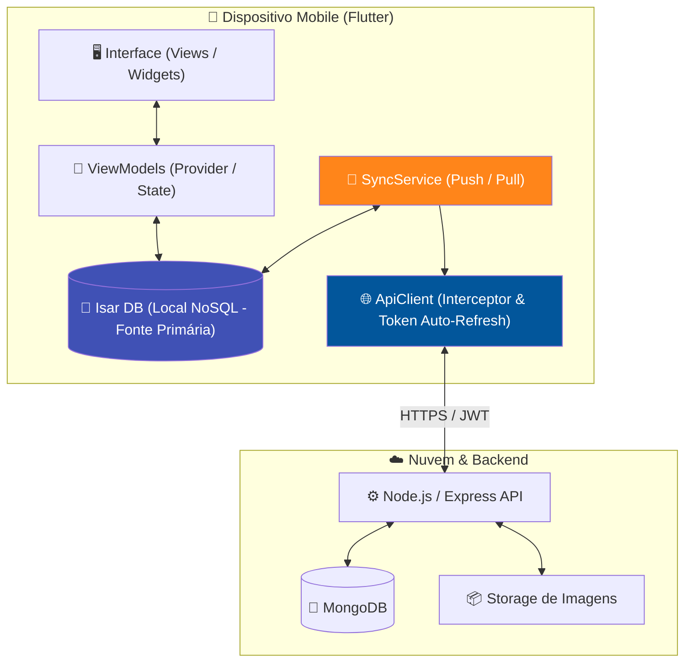

<div align="center">

# 📱 RotaRDV Mobile — Gestão de Despesas e Viagens

**Aplicativo mobile Offline-First para controle e prestação de contas de viagens em transportadoras rodoviárias.**

Permite que motoristas registrem viagens e despesas detalhadas mesmo em locais sem qualquer sinal de internet, sincronizando tudo automaticamente com a nuvem quando a conexão for restabelecida.

[](https://flutter.dev)
[](https://dart.dev)
[](https://isar.dev)
[](https://developer.android.com)
[](https://developer.apple.com/ios/)
[](LICENSE)


</div>

---

## 📋 Sumário

- [💡 Sobre o Projeto](#-sobre-o-projeto)
- [✨ Principais Funcionalidades](#-principais-funcionalidades)
- [🏛️ Arquitetura Offline-First & Sincronização](#️-arquitetura-offline-first--sincronização)
- [🛠️ Tecnologias & Bibliotecas](#️-tecnologias--bibliotecas)
- [📁 Estrutura de Pastas](#-estrutura-de-pastas)
- [🚀 Instalação & Configuração](#-instalação--configuração)
- [▶️ Executando o Aplicativo](#️-executando-o-aplicativo)
- [🧪 Testes & Análise Estática](#-testes--análise-estática)
- [🔄 CI/CD](#-cicd)
- [🔗 Projetos Relacionados](#-projetos-relacionados)
- [📄 Licença](#-licença)

---

## 💡 Sobre o Projeto

O **RotaRDV Mobile** foi projetado especificamente para o cenário de transporte de cargas no Brasil, onde motoristas frequentemente trafegam por rodovias e regiões remotas com sinal de dados instável ou ausente.

Construído com base no paradigma **Offline-First**, o aplicativo trata o banco de dados local do dispositivo (**Isar NoSQL**) como a **fonte da verdade primária**. O usuário tem resposta instantânea (latência zero) para qualquer operação, enquanto um motor inteligente em segundo plano gerencia a comunicação e sincronização bidirecional com a [API RESTful RotaRDV](https://gitlab.fslab.dev/tcc-registro-de-despesas-luis/tcc-despesas-api).

---

## ✨ Principais Funcionalidades

- 🔐 **Autenticação Dupla:** Suporte a Login tradicional (E-mail/Senha) e **Google Sign-In (OAuth2)**.
- ⚡ **Sessão Persistente & Auto-Renew:** Usuário permanece conectado no dispositivo. O cliente HTTP renova o token JWT silenciosamente via `/refresh` sem interromper a navegação.
- 📴 **Operação 100% Offline:** Cadastro, visualização e manipulação de viagens e despesas funcionam sem internet.
- 🔄 **Motor de Sincronização Bidirecional:**
  - **Push:** Envia alterações locais pendentes (`criado`, `editado`, `deletado`) para a nuvem.
  - **Pull Incremental:** Baixa novos registros criados em outros dispositivos usando timestamp UTC (`updatedAfter`).
- 🌐 **Barra de Conectividade em Tempo Real:** Componente visual (`NetworkStatusBar`) que alerta instantaneamente sobre o estado da conexão (Online / Offline).
- 🛡️ **Proteção contra Perda de Dados:** O app impede o logout caso existam dados locais não sincronizados sem conexão com a internet.
- 🎨 **Design System Moderno:** Interface escura temática com alto contraste, fontes Google Lexend e micro-interações fluidas.

---

## 🏛️ Arquitetura Offline-First & Sincronização

### Diagrama Arquitetural de Dados


```mermaid
graph TD
    subgraph Mobile ["📱 Dispositivo Mobile (Flutter)"]
        UI["🖥️ Interface (Views / Widgets)"]
        VM["🧠 ViewModels (Provider / State)"]
        Isar[("💾 Isar DB (Local NoSQL - Fonte Primária)")]
        Sync["🔄 SyncService (Push / Pull)"]
        Client["🌐 ApiClient (Interceptor & Token Auto-Refresh)"]
        
        UI <--> VM
        VM <--> Isar
        Sync <--> Isar
        Sync --> Client
    end

    subgraph Backend ["☁️ Nuvem & Backend"]
        API["⚙️ Node.js / Express API"]
        Mongo[("🍃 MongoDB")]
        Storage["📦 Storage de Imagens"]
        
        Client <-->|HTTPS / JWT| API
        API <--> Mongo
        API <--> Storage
    end

    style Isar fill:#4051B5,color:#fff
    style Client fill:#02569B,color:#fff
    style Sync fill:#FF851A,color:#fff
```

### Ciclo de Vida da Sincronização

1. **Criação Local:** Ao registrar uma viagem ou despesa, é gerado um `UUID v4` e o registro é gravado no Isar com status `statusSincronizacao = 'criado'`.
2. **Push:** Ao detectar conexão, o `SyncService` coleta todos os registros com status `criado`, `editado` ou `deletado` e dispara `POST /sync/push`. Em caso de sucesso, atualiza o status local para `sincronizado`.
3. **Pull Incremental:** Ao abrir ou atualizar a Home, o app faz `GET /sync/pull?updatedAfter=...` trazendo apenas dados modificados desde a última sincronização com sucesso.

---

## 🛠️ Tecnologias & Bibliotecas

| Categoria | Tecnologia | Finalidade |
| :--- | :--- | :--- |
| **Linguagem & SDK** | Dart 3.11+ / Flutter 3.11+ | Desenvolvimento multiplataforma |
| **Banco Local** | [Isar Database](https://pub.dev/packages/isar) 3.1 | Banco NoSQL local de alta performance |
| **Gerenciamento de Estado** | [Provider](https://pub.dev/packages/provider) 6.1 | Padrão MVVM reativo e desacoplado |
| **Rede & HTTP** | [http](https://pub.dev/packages/http) | Cliente HTTP integrado ao `ApiClient` central |
| **Autenticação** | Firebase Auth & Google Sign-In | Autenticação federada com Google |
| **Conectividade** | [connectivity_plus](https://pub.dev/packages/connectivity_plus) | Monitoramento de estado de rede em tempo real |
| **Armazenamento Seguro** | [shared_preferences](https://pub.dev/packages/shared_preferences) | Persistência de tokens JWT e metadados |
| **Configurações** | [flutter_dotenv](https://pub.dev/packages/flutter_dotenv) | Carregamento de variáveis de ambiente `.env` |
| **Tipografia & Estilo** | [google_fonts](https://pub.dev/packages/google_fonts) (Lexend) | Design system refinado com Material 3 |
| **Identificadores** | [uuid](https://pub.dev/packages/uuid) | Geração de UUIDs compatíveis com MongoDB |

---

## 📁 Estrutura de Pastas

O projeto adota uma variação limpa de **Feature-First + Clean Architecture**, espelhando o padrão arquitetural do projeto base **`fipe50`**:

```
lib/
├── 🚀 main.dart                            # Ponto de entrada, inicialização do Isar e injeção global
├── 🗺️ routes.dart                          # Definição e mapeamento centralizado de rotas
│
├── 🧱 core/                               # Núcleo compartilhado da aplicação
│   ├── constants/
│   │   └── api_constants.dart             # URLs e endpoints base da API
│   ├── database/
│   │   └── local_database.dart            # Inicialização e instância singleton do Isar
│   ├── network/
│   │   └── api_client.dart                # Cliente HTTP com Interceptor e Auto-Refresh de Token
│   ├── theme/
│   │   └── app_theme.dart                 # Tokens de cores (AppColors) e ThemeData (AppTheme)
│   └── widgets/
│       ├── custom_bottom_nav_bar.dart     # Barra de navegação inferior customizada
│       ├── custom_refresh_indicator.dart  # Indicador de pull-to-refresh estilizado
│       └── network_status_bar.dart        # Barra reativa de conectividade online/offline
│
├── 📦 models/                             # Modelos e Schemas do Banco Local Isar
│   ├── viagem_collection.dart             # Model de Viagem com anotações @collection
│   ├── viagem_collection.g.dart           # Código gerado pelo build_runner para Viagem
│   ├── despesa_collection.dart            # Model de Despesa com anotações @collection
│   └── despesa_collection.g.dart          # Código gerado pelo build_runner para Despesa
│
├── 🧩 features/                           # Módulos de funcionalidades de negócio
│   ├── auth/                              # Autenticação e Gestão de Usuário
│   │   ├── auth_viewmodel.dart            # ViewModel de login, tokens e estado da sessão
│   │   └── presentation/pages/
│   │       └── login_page.dart            # Tela de login (Local + Google Sign-In)
│   ├── home/                              # Painel Principal / Dashboard
│   │   ├── home_viewmodel.dart            # ViewModel da Home (carregamento Isar + sync)
│   │   └── home_page.dart                 # Tela principal com listagem de viagens
│   └── sync/                              # Módulo de Sincronização
│       └── sync_service.dart              # Regras de push/pull e resolução de conflitos
│
├── 🌐 services/                           # Serviços de integração externa
│   └── auth_service.dart                  # Chamadas diretas aos endpoints de autenticação
│
└── 📚 docs/                               # Documentações técnicas de arquitetura
    └── arquitetura_imagens_offline_first.md
```

---

## 🚀 Instalação & Configuração

### Pré-requisitos

- **Flutter SDK:** `>= 3.11.0`
- **Dart SDK:** `>= 3.11.0`
- **Android Studio** ou **VS Code** com extensões Flutter/Dart instaladas

### 1. Clonar o Repositório

```bash
git clone https://gitlab.fslab.dev/tcc-registro-de-despesas-luis/tcc-despesas-mobile.git
cd tcc-despesas-mobile
```

### 2. Instalar Dependências

```bash
flutter pub get
```

### 3. Configurar Variáveis de Ambiente (`.env`)

Crie o arquivo `.env` na raiz do projeto (ou copie a partir de `.env.example`):

```bash
cp .env.example .env
```

Edite o `.env` com suas credenciais:

```env
GOOGLE_CLIENT_ID=seu_client_id_google_oauth_aqui
```

> **Nota sobre a URL da API:** Para ajustar o endpoint da API, altere o arquivo `lib/core/constants/api_constants.dart`.

### 4. Gerar Código do Banco Local (Isar Generators)

Sempre que modificar ou recriar os modelos em `lib/models/`, execute:

```bash
flutter pub run build_runner build --delete-conflicting-outputs
```

---

## ▶️ Executando o Aplicativo

### Android

```bash
# Listar emuladores ou aparelhos físicos conectados
flutter devices

# Executar em modo Debug
flutter run

# Gerar APK de Release
flutter build apk --release

# Gerar App Bundle (.aab) para Google Play
flutter build appbundle --release
```

### iOS *(requer macOS com Xcode)*

```bash
# Executar no simulador
flutter run -d iPhone

# Gerar IPA de Release
flutter build ipa --release
```

---

## 🧪 Testes & Análise Estática

```bash
# Executar análise estática de código (Linter)
flutter analyze

# Executar suíte de testes unitários
flutter test

# Executar com relatório de cobertura
flutter test --coverage
```

---

## 🔄 CI/CD

O repositório possui integração contínua configurada via **GitLab CI** (`.gitlab-ci.yml`), executando análises automáticas de segurança a cada push e Merge Request:

- **SAST:** Análise estática de vulnerabilidades e boas práticas no código-fonte.
- **Secret Detection:** Varredura preventiva para impedir vazamento de chaves ou credenciais privadas.

---

## 🔗 Projetos Relacionados

| Projeto | Descrição | Repositório |
| :--- | :--- | :--- |
| 🧾 **RotaRDV API** | API RESTful (Node.js + Express + MongoDB + JWT) | [GitLab API](https://gitlab.fslab.dev/tcc-registro-de-despesas-luis/tcc-despesas-api) |
| 📱 **RotaRDV Mobile** | App Mobile Offline-First (Flutter + Isar) | *Este Repositório* |

---

## 📄 Licença

Este projeto está licenciado sob os termos da **MIT License**. Veja o arquivo [LICENSE](LICENSE) para mais detalhes.

---

<div align="center">

Desenvolvido por **Luis Felipe Lopes** como Trabalho de Conclusão de Curso (TCC).


</div>
